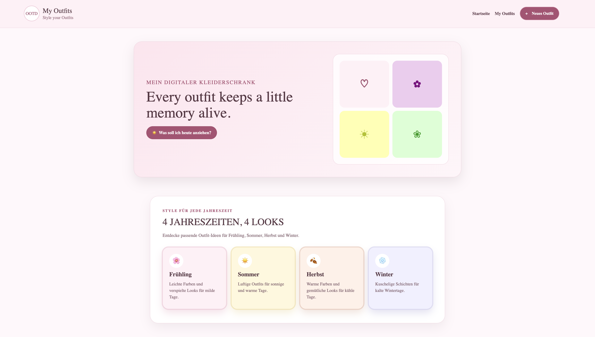
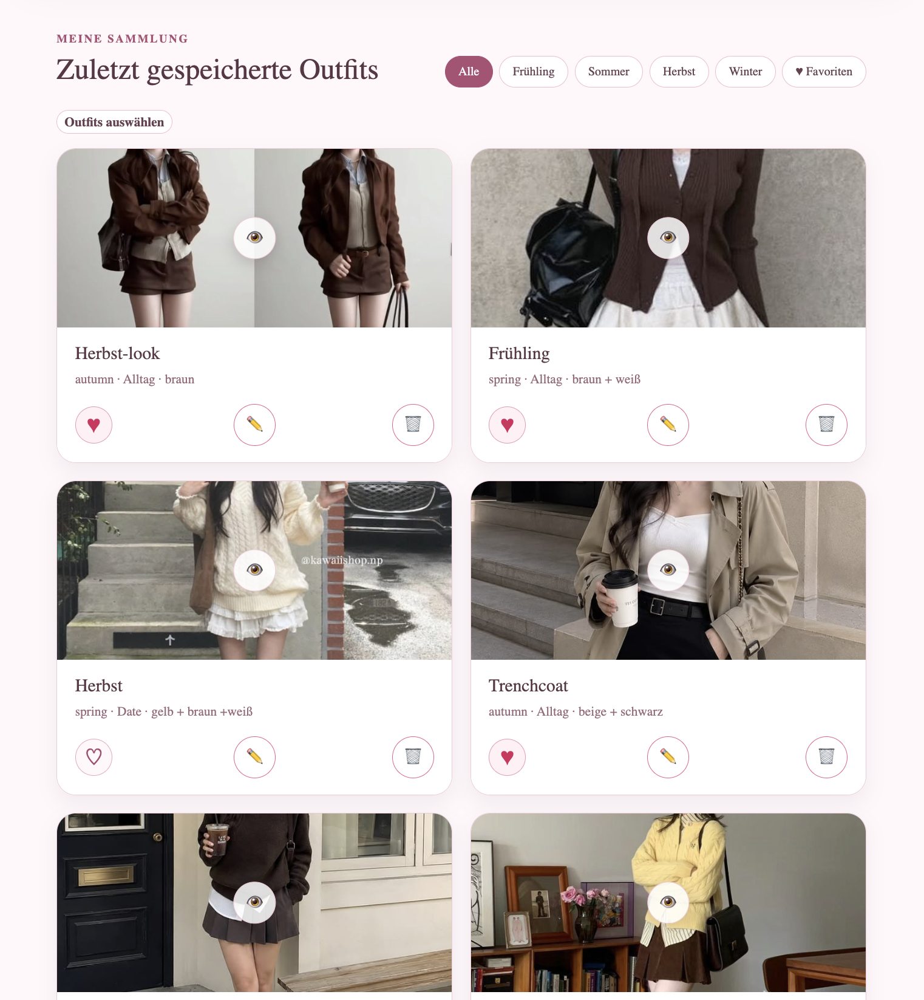
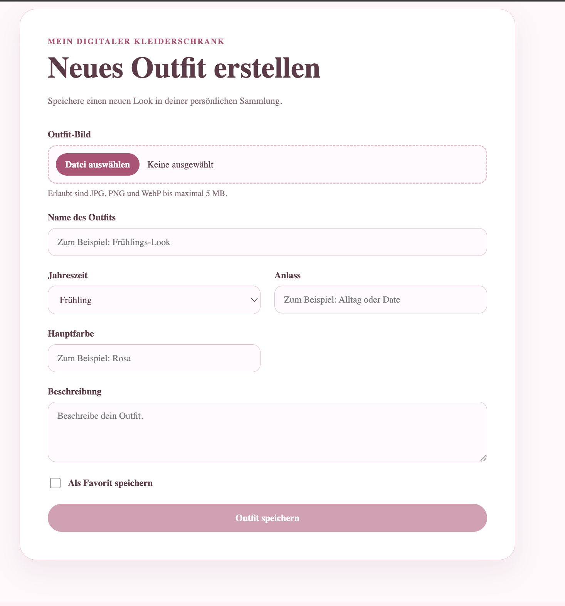
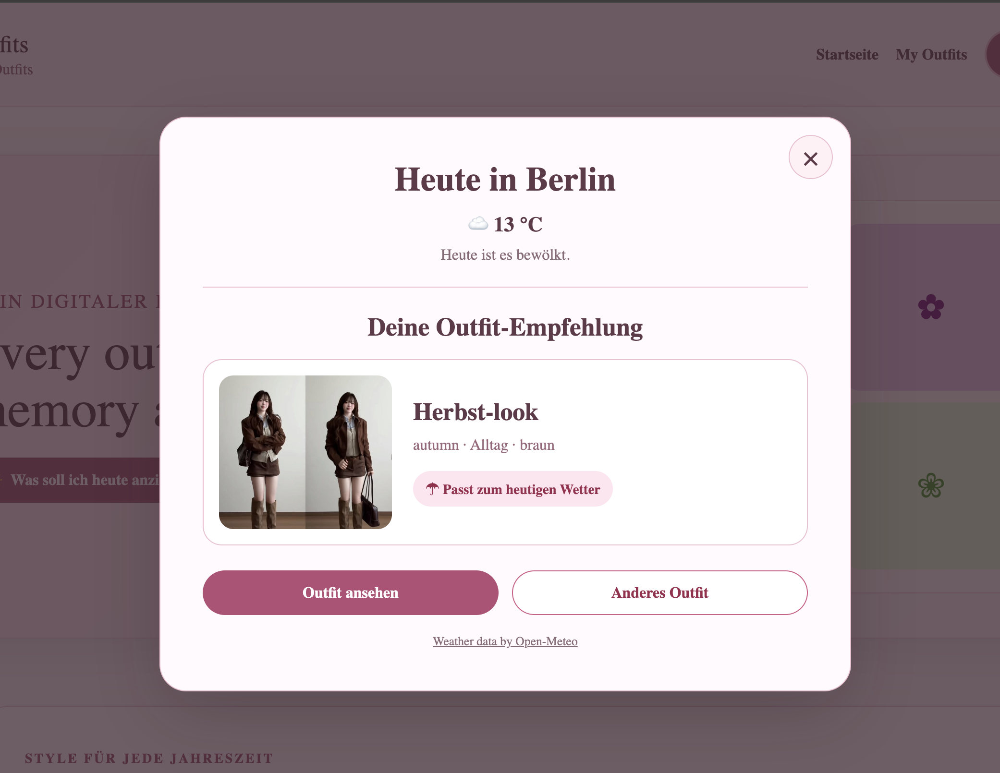

# My Outfits – Frontend

My Outfits ist ein digitaler Kleiderschrank, in dem persönliche Outfits mit Bildern und zusätzlichen Informationen gespeichert und verwaltet werden können.

Die Anwendung entstand im Rahmen des Moduls **Web-Technologien** an der HTW Berlin im Sommersemester 2026.

## Funktionen

- Neue Outfits mit Bild und Informationen anlegen
- Vorhandene Outfits bearbeiten
- Bilder eines Outfits ersetzen
- Einzelne oder mehrere Outfits löschen
- Outfits als Favoriten markieren
- Outfits nach Jahreszeit oder Favoriten filtern
- Bilder in einer vergrößerten Galerie anzeigen
- Zwischen Bildern vor- und zurückwechseln
- Bildvorschau direkt nach der Dateiauswahl
- Wetterbasierte Outfit-Empfehlung
- Verwendung des aktuellen Standorts nach Zustimmung
- Berlin als Ersatzstandort bei abgelehnter Standortfreigabe
- Responsive Darstellung für Desktop, Tablet und Smartphone

## Outfit-Daten

Ein Outfit enthält folgende Informationen:

- Name
- Jahreszeit
- Anlass
- Hauptfarbe
- Beschreibung
- Favoritenstatus
- Bild

Unterstützte Bildformate:

- JPG und JPEG
- PNG
- WebP
- Maximale Dateigröße: 5 MB

## Wetterbasierte Empfehlung

Über die Schaltfläche **„Was soll ich heute anziehen?“** kann eine Outfit-Empfehlung geöffnet werden.

Die Anwendung:

1. fragt nach dem aktuellen Standort,
2. lädt das aktuelle Wetter über Open-Meteo,
3. ordnet die gefühlte Temperatur einer passenden Jahreszeit zu,
4. wählt ein gespeichertes Outfit dieser Jahreszeit aus.

Wenn der Zugriff auf den Standort abgelehnt wird oder nicht verfügbar ist, wird automatisch Berlin verwendet.

Die Standortdaten werden nicht dauerhaft gespeichert.

## Verwendete Technologien

- Angular 22
- TypeScript 6
- HTML5
- CSS3
- Bootstrap 5.3
- RxJS
- Angular Forms
- Angular Router
- Vitest
- Open-Meteo API
- Node.js und npm

## Architektur

Das Projekt besteht aus zwei getrennten Anwendungen:

- **Frontend:** Angular-Anwendung in diesem Repository
- **Backend:** Node.js-, Express- und MongoDB-Anwendung

Backend-Repository:

[myoutfits-backend](https://github.com/SunnyKim620/myoutfits-backend)

Das Frontend kommuniziert über eine REST-API mit dem Backend.

## Voraussetzungen

Zum lokalen Ausführen werden benötigt:

- Node.js
- npm
- das laufende My-Outfits-Backend
- eine MongoDB-Verbindung für das Backend

Verwendete Entwicklungsumgebung:

- Node.js 24.19.0
- npm 11.17.0
- Angular CLI 22.1.5

## Installation

Repository klonen:

```bash
git clone https://github.com/SunnyKim620/myoutfits-frontend.git
```

In den Projektordner wechseln:

```bash
cd myoutfits-frontend
```

Abhängigkeiten installieren:

```bash
npm install
```

## Anwendung starten

Zuerst muss das Backend auf Port `3000` gestartet werden.

Danach kann das Frontend gestartet werden:

```bash
npm start
```

Die Anwendung ist anschließend unter folgender Adresse erreichbar:

```text
http://localhost:4200
```

Die Backend-API wird lokal unter folgender Adresse erwartet:

```text
http://localhost:3000
```

## Produktions-Build erstellen

```bash
npm run build
```

Die erzeugten Dateien befinden sich anschließend im Ordner `dist/`.

## Tests ausführen

Alle Tests einmalig ausführen:

```bash
ng test --watch=false
```

Aktueller Teststand:

- 6 Testdateien
- 7 erfolgreiche Tests

## REST-Schnittstelle

| Methode | Route | Funktion |
|---|---|---|
| GET | `/api/outfits` | Alle Outfits laden |
| GET | `/api/outfits/:id` | Ein Outfit laden |
| POST | `/api/outfits` | Neues Outfit erstellen |
| PUT | `/api/outfits/:id` | Outfit aktualisieren |
| PATCH | `/api/outfits/:id/favorite` | Favoritenstatus ändern |
| DELETE | `/api/outfits/:id` | Outfit löschen |

## Projektstruktur

```text
src/app/
├── models/
│   └── outfit.ts
├── pages/
│   ├── home/
│   ├── new-outfit/
│   └── edit-outfit/
├── services/
│   ├── outfit.ts
│   └── weather.ts
├── app.routes.ts
└── app.ts
```

## Screenshots

### Startseite



### Outfit-Sammlung und Saisonfilter



### Neues Outfit erstellen



### Wetterbasierte Outfit-Empfehlung



## Externe Datenquelle

Die Wetterdaten werden von [Open-Meteo](https://open-meteo.com/) bereitgestellt.


## Verzeichnis der verwendeten KI-Werkzeuge

- **ChatGPT / Codex (OpenAI):** Unterstützung bei der Erklärung von Angular-, TypeScript- und CSS-Konzepten, bei der Planung einzelner Funktionen, bei der Fehlersuche sowie bei Vorschlägen für Codeabschnitte, Kommentare und Dokumentation.

Alle Vorschläge wurden geprüft, an das Projekt angepasst und durch Builds, Tests und manuelle Funktionsprüfungen kontrolliert. Die Verantwortung für die Umsetzung und das Verständnis des Projekts liegt bei der Autorin.

## Autorin

**Son Yong Kim**  
HTW Berlin – Web-Technologien  
Sommersemester 2026
